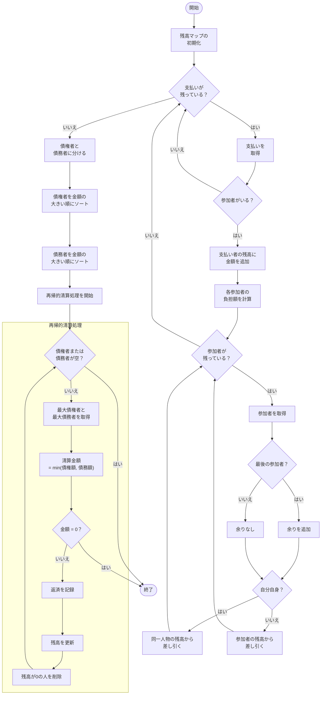

# warikan

## Develop

1. `.env.example` を `.env` にコピーし、環境変数を設定する
1. DevContainer を起動する

## Deploy

 1. ブランチに push すると、GitHub Actions がビルドを行う
 1. ビルドが成功したら、Dockerfile をビルドしてイメージを作成する
 1. イメージを GitHub Container Registry に push する

## Algorithm

